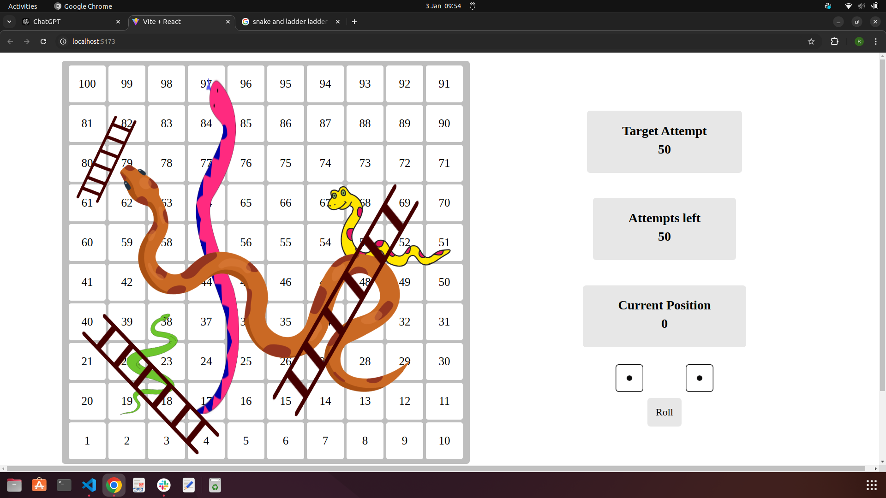

# 🎲 Snake and Ladders
A classic 2D board game where luck meets strategy! Roll the dice 🎲, climb the ladders 🪜, and avoid the sneaky snakes 🐍 as you race to the finish line. Will fortune be on your side? 🎯🐍🚀  

## 🎲 Key Features
- 🎯 **The Game Begins** – You can’t start moving until you roll a `1`. Keep rolling until you get it!  
- ⏳ **Limited Attempts** – The game assigns you a random number of attempts. Reach the finish before they run out!  
- 🎲 **Double Dice Roll** – Instead of one, you roll two dice at a time for extra strategy.  
- 🔄 **Re-Roll Option** – Don’t like your total points? Re-roll without losing an attempt!  
- 🔒 **Dice Locking** – Like one dice 🎲 but not the other? Lock the one you want and re-roll only the unlocked dice. But you can’t lock both at the same time!  
- 🚀 **Strategic Moves** – If your first dice roll lands on a ladder 🪜 or a snake 🐍, it moves first. Climb up if lucky, or slide down if not!  

## 🚀 Tech Stack
- 🟨 **JavaScript**: Core logic and game mechanics.  
- ⚛️ **React.js**: Smooth UI and state management for seamless gameplay.  
- 🎨 **CSS5**: Clean, and modern styling.  
- 📦 **Redux**: Efficient state management to track the game’s progress.  

## 🎮 Game Interface
Here's a preview of the game interface:  

 

This is where all the action happens! 🎲 Roll the dice, make your moves, and strategize your way to victory!  

## Run Locally
Clone the project
```bash
  git clone https://github.com/Rayhan-shellbeehaken/Snake_And_Ladders.git
```
Go to the project directory
```bash
  cd Snake_And_Ladders
```
Install dependencies
```bash
  npm install
```
Start the project
```bash
  npm run dev
```
